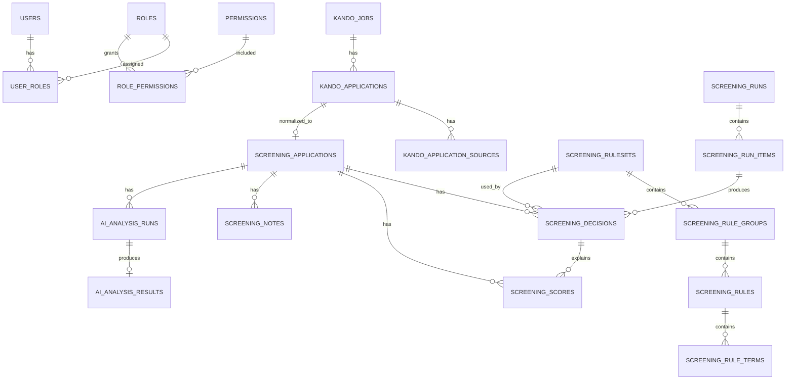

# ERD

```mermaid
erDiagram
  USERS ||--o{ USER_ROLES : has
  ROLES ||--o{ USER_ROLES : assigned
  ROLES ||--o{ ROLE_PERMISSIONS : grants
  PERMISSIONS ||--o{ ROLE_PERMISSIONS : included

  KANDO_JOBS ||--o{ KANDO_APPLICATIONS : has
  KANDO_APPLICATIONS ||--o{ KANDO_APPLICATION_SOURCES : has
  KANDO_APPLICATIONS ||--o| SCREENING_APPLICATIONS : normalized_to
  SCREENING_APPLICATIONS ||--o{ SCREENING_DECISIONS : has
  SCREENING_APPLICATIONS ||--o{ SCREENING_SCORES : has
  SCREENING_APPLICATIONS ||--o{ SCREENING_NOTES : has
  SCREENING_APPLICATIONS ||--o{ AI_ANALYSIS_RUNS : has

  SCREENING_RULESETS ||--o{ SCREENING_RULE_GROUPS : contains
  SCREENING_RULE_GROUPS ||--o{ SCREENING_RULES : contains
  SCREENING_RULES ||--o{ SCREENING_RULE_TERMS : contains
  SCREENING_RULESETS ||--o{ SCREENING_DECISIONS : used_by
  SCREENING_DECISIONS ||--o{ SCREENING_SCORES : explains

  AI_ANALYSIS_RUNS ||--o| AI_ANALYSIS_RESULTS : produces
  SCREENING_RUNS ||--o{ SCREENING_RUN_ITEMS : contains
  SCREENING_RUN_ITEMS ||--o{ SCREENING_DECISIONS : produces
```
